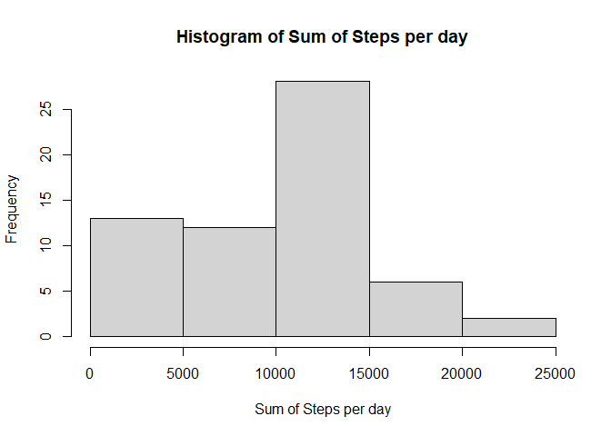
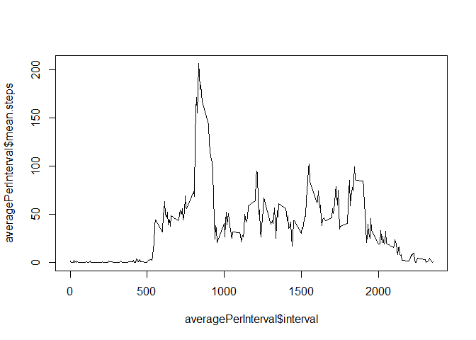
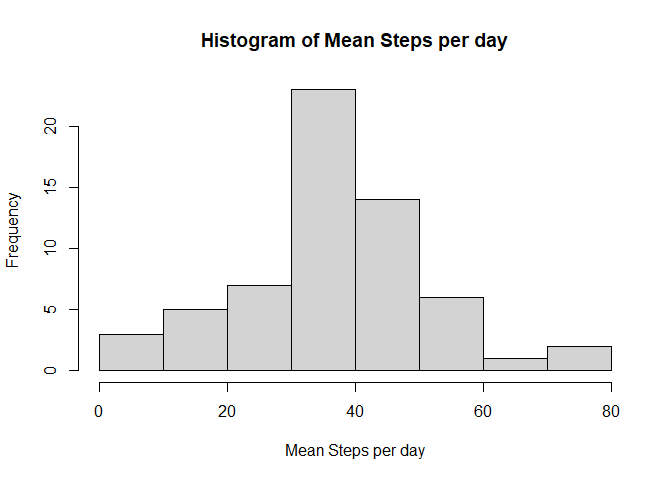
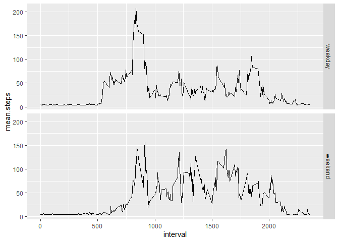

## Load libraries  

```r
library(dplyr)
library(imputeTS)
library(kableExtra)
library(ggplot2)
```


## Loading and preprocessing the data  

```r
activity <- read.csv("activity.csv")

#I want to convert the minute into text and as HHMM
intervalCh <- as.character(activity$interval)

activity$time <-  sapply(intervalCh, function(x){
    strlength <- nchar(x)
    return(paste(paste(rep("0", 4-strlength),collapse =  ""),x, 
                     sep = ""))
    }, USE.NAMES = FALSE)
activity$dateTime <- with(activity,
                          strptime(paste(date,time),
                                   format = "%F %H%M"))
activity$date <- with(activity,
                          strptime(date,
                                   format = "%F"))
```


## What is mean total number of steps taken per day?  


```r
meanPerDay = activity %>% group_by(date) %>% 
    summarise(mean.steps = mean(steps, na.rm = T),
              median.steps = median(steps, na.rm = T))
```

```
## `summarise()` ungrouping output (override with `.groups` argument)
```

```r
hist(meanPerDay$mean.steps,
     main = "Histogram of Mean Steps per day",
     xlab = "Mean Steps per day")
```

<!-- -->
  
This is a table of median and mean per day  


```r
kbl(meanPerDay) %>% 
    kable_styling()
```

<table class="table" style="margin-left: auto; margin-right: auto;">
 <thead>
  <tr>
   <th style="text-align:left;"> date </th>
   <th style="text-align:right;"> mean.steps </th>
   <th style="text-align:right;"> median.steps </th>
  </tr>
 </thead>
<tbody>
  <tr>
   <td style="text-align:left;"> 2012-10-01 </td>
   <td style="text-align:right;"> NaN </td>
   <td style="text-align:right;"> NA </td>
  </tr>
  <tr>
   <td style="text-align:left;"> 2012-10-02 </td>
   <td style="text-align:right;"> 0.4375000 </td>
   <td style="text-align:right;"> 0 </td>
  </tr>
  <tr>
   <td style="text-align:left;"> 2012-10-03 </td>
   <td style="text-align:right;"> 39.4166667 </td>
   <td style="text-align:right;"> 0 </td>
  </tr>
  <tr>
   <td style="text-align:left;"> 2012-10-04 </td>
   <td style="text-align:right;"> 42.0694444 </td>
   <td style="text-align:right;"> 0 </td>
  </tr>
  <tr>
   <td style="text-align:left;"> 2012-10-05 </td>
   <td style="text-align:right;"> 46.1597222 </td>
   <td style="text-align:right;"> 0 </td>
  </tr>
  <tr>
   <td style="text-align:left;"> 2012-10-06 </td>
   <td style="text-align:right;"> 53.5416667 </td>
   <td style="text-align:right;"> 0 </td>
  </tr>
  <tr>
   <td style="text-align:left;"> 2012-10-07 </td>
   <td style="text-align:right;"> 38.2465278 </td>
   <td style="text-align:right;"> 0 </td>
  </tr>
  <tr>
   <td style="text-align:left;"> 2012-10-08 </td>
   <td style="text-align:right;"> NaN </td>
   <td style="text-align:right;"> NA </td>
  </tr>
  <tr>
   <td style="text-align:left;"> 2012-10-09 </td>
   <td style="text-align:right;"> 44.4826389 </td>
   <td style="text-align:right;"> 0 </td>
  </tr>
  <tr>
   <td style="text-align:left;"> 2012-10-10 </td>
   <td style="text-align:right;"> 34.3750000 </td>
   <td style="text-align:right;"> 0 </td>
  </tr>
  <tr>
   <td style="text-align:left;"> 2012-10-11 </td>
   <td style="text-align:right;"> 35.7777778 </td>
   <td style="text-align:right;"> 0 </td>
  </tr>
  <tr>
   <td style="text-align:left;"> 2012-10-12 </td>
   <td style="text-align:right;"> 60.3541667 </td>
   <td style="text-align:right;"> 0 </td>
  </tr>
  <tr>
   <td style="text-align:left;"> 2012-10-13 </td>
   <td style="text-align:right;"> 43.1458333 </td>
   <td style="text-align:right;"> 0 </td>
  </tr>
  <tr>
   <td style="text-align:left;"> 2012-10-14 </td>
   <td style="text-align:right;"> 52.4236111 </td>
   <td style="text-align:right;"> 0 </td>
  </tr>
  <tr>
   <td style="text-align:left;"> 2012-10-15 </td>
   <td style="text-align:right;"> 35.2048611 </td>
   <td style="text-align:right;"> 0 </td>
  </tr>
  <tr>
   <td style="text-align:left;"> 2012-10-16 </td>
   <td style="text-align:right;"> 52.3750000 </td>
   <td style="text-align:right;"> 0 </td>
  </tr>
  <tr>
   <td style="text-align:left;"> 2012-10-17 </td>
   <td style="text-align:right;"> 46.7083333 </td>
   <td style="text-align:right;"> 0 </td>
  </tr>
  <tr>
   <td style="text-align:left;"> 2012-10-18 </td>
   <td style="text-align:right;"> 34.9166667 </td>
   <td style="text-align:right;"> 0 </td>
  </tr>
  <tr>
   <td style="text-align:left;"> 2012-10-19 </td>
   <td style="text-align:right;"> 41.0729167 </td>
   <td style="text-align:right;"> 0 </td>
  </tr>
  <tr>
   <td style="text-align:left;"> 2012-10-20 </td>
   <td style="text-align:right;"> 36.0937500 </td>
   <td style="text-align:right;"> 0 </td>
  </tr>
  <tr>
   <td style="text-align:left;"> 2012-10-21 </td>
   <td style="text-align:right;"> 30.6284722 </td>
   <td style="text-align:right;"> 0 </td>
  </tr>
  <tr>
   <td style="text-align:left;"> 2012-10-22 </td>
   <td style="text-align:right;"> 46.7361111 </td>
   <td style="text-align:right;"> 0 </td>
  </tr>
  <tr>
   <td style="text-align:left;"> 2012-10-23 </td>
   <td style="text-align:right;"> 30.9652778 </td>
   <td style="text-align:right;"> 0 </td>
  </tr>
  <tr>
   <td style="text-align:left;"> 2012-10-24 </td>
   <td style="text-align:right;"> 29.0104167 </td>
   <td style="text-align:right;"> 0 </td>
  </tr>
  <tr>
   <td style="text-align:left;"> 2012-10-25 </td>
   <td style="text-align:right;"> 8.6527778 </td>
   <td style="text-align:right;"> 0 </td>
  </tr>
  <tr>
   <td style="text-align:left;"> 2012-10-26 </td>
   <td style="text-align:right;"> 23.5347222 </td>
   <td style="text-align:right;"> 0 </td>
  </tr>
  <tr>
   <td style="text-align:left;"> 2012-10-27 </td>
   <td style="text-align:right;"> 35.1354167 </td>
   <td style="text-align:right;"> 0 </td>
  </tr>
  <tr>
   <td style="text-align:left;"> 2012-10-28 </td>
   <td style="text-align:right;"> 39.7847222 </td>
   <td style="text-align:right;"> 0 </td>
  </tr>
  <tr>
   <td style="text-align:left;"> 2012-10-29 </td>
   <td style="text-align:right;"> 17.4236111 </td>
   <td style="text-align:right;"> 0 </td>
  </tr>
  <tr>
   <td style="text-align:left;"> 2012-10-30 </td>
   <td style="text-align:right;"> 34.0937500 </td>
   <td style="text-align:right;"> 0 </td>
  </tr>
  <tr>
   <td style="text-align:left;"> 2012-10-31 </td>
   <td style="text-align:right;"> 53.5208333 </td>
   <td style="text-align:right;"> 0 </td>
  </tr>
  <tr>
   <td style="text-align:left;"> 2012-11-01 </td>
   <td style="text-align:right;"> NaN </td>
   <td style="text-align:right;"> NA </td>
  </tr>
  <tr>
   <td style="text-align:left;"> 2012-11-02 </td>
   <td style="text-align:right;"> 36.8055556 </td>
   <td style="text-align:right;"> 0 </td>
  </tr>
  <tr>
   <td style="text-align:left;"> 2012-11-03 </td>
   <td style="text-align:right;"> 36.7048611 </td>
   <td style="text-align:right;"> 0 </td>
  </tr>
  <tr>
   <td style="text-align:left;"> 2012-11-04 </td>
   <td style="text-align:right;"> NaN </td>
   <td style="text-align:right;"> NA </td>
  </tr>
  <tr>
   <td style="text-align:left;"> 2012-11-05 </td>
   <td style="text-align:right;"> 36.2465278 </td>
   <td style="text-align:right;"> 0 </td>
  </tr>
  <tr>
   <td style="text-align:left;"> 2012-11-06 </td>
   <td style="text-align:right;"> 28.9375000 </td>
   <td style="text-align:right;"> 0 </td>
  </tr>
  <tr>
   <td style="text-align:left;"> 2012-11-07 </td>
   <td style="text-align:right;"> 44.7326389 </td>
   <td style="text-align:right;"> 0 </td>
  </tr>
  <tr>
   <td style="text-align:left;"> 2012-11-08 </td>
   <td style="text-align:right;"> 11.1770833 </td>
   <td style="text-align:right;"> 0 </td>
  </tr>
  <tr>
   <td style="text-align:left;"> 2012-11-09 </td>
   <td style="text-align:right;"> NaN </td>
   <td style="text-align:right;"> NA </td>
  </tr>
  <tr>
   <td style="text-align:left;"> 2012-11-10 </td>
   <td style="text-align:right;"> NaN </td>
   <td style="text-align:right;"> NA </td>
  </tr>
  <tr>
   <td style="text-align:left;"> 2012-11-11 </td>
   <td style="text-align:right;"> 43.7777778 </td>
   <td style="text-align:right;"> 0 </td>
  </tr>
  <tr>
   <td style="text-align:left;"> 2012-11-12 </td>
   <td style="text-align:right;"> 37.3784722 </td>
   <td style="text-align:right;"> 0 </td>
  </tr>
  <tr>
   <td style="text-align:left;"> 2012-11-13 </td>
   <td style="text-align:right;"> 25.4722222 </td>
   <td style="text-align:right;"> 0 </td>
  </tr>
  <tr>
   <td style="text-align:left;"> 2012-11-14 </td>
   <td style="text-align:right;"> NaN </td>
   <td style="text-align:right;"> NA </td>
  </tr>
  <tr>
   <td style="text-align:left;"> 2012-11-15 </td>
   <td style="text-align:right;"> 0.1423611 </td>
   <td style="text-align:right;"> 0 </td>
  </tr>
  <tr>
   <td style="text-align:left;"> 2012-11-16 </td>
   <td style="text-align:right;"> 18.8923611 </td>
   <td style="text-align:right;"> 0 </td>
  </tr>
  <tr>
   <td style="text-align:left;"> 2012-11-17 </td>
   <td style="text-align:right;"> 49.7881944 </td>
   <td style="text-align:right;"> 0 </td>
  </tr>
  <tr>
   <td style="text-align:left;"> 2012-11-18 </td>
   <td style="text-align:right;"> 52.4652778 </td>
   <td style="text-align:right;"> 0 </td>
  </tr>
  <tr>
   <td style="text-align:left;"> 2012-11-19 </td>
   <td style="text-align:right;"> 30.6979167 </td>
   <td style="text-align:right;"> 0 </td>
  </tr>
  <tr>
   <td style="text-align:left;"> 2012-11-20 </td>
   <td style="text-align:right;"> 15.5277778 </td>
   <td style="text-align:right;"> 0 </td>
  </tr>
  <tr>
   <td style="text-align:left;"> 2012-11-21 </td>
   <td style="text-align:right;"> 44.3993056 </td>
   <td style="text-align:right;"> 0 </td>
  </tr>
  <tr>
   <td style="text-align:left;"> 2012-11-22 </td>
   <td style="text-align:right;"> 70.9270833 </td>
   <td style="text-align:right;"> 0 </td>
  </tr>
  <tr>
   <td style="text-align:left;"> 2012-11-23 </td>
   <td style="text-align:right;"> 73.5902778 </td>
   <td style="text-align:right;"> 0 </td>
  </tr>
  <tr>
   <td style="text-align:left;"> 2012-11-24 </td>
   <td style="text-align:right;"> 50.2708333 </td>
   <td style="text-align:right;"> 0 </td>
  </tr>
  <tr>
   <td style="text-align:left;"> 2012-11-25 </td>
   <td style="text-align:right;"> 41.0902778 </td>
   <td style="text-align:right;"> 0 </td>
  </tr>
  <tr>
   <td style="text-align:left;"> 2012-11-26 </td>
   <td style="text-align:right;"> 38.7569444 </td>
   <td style="text-align:right;"> 0 </td>
  </tr>
  <tr>
   <td style="text-align:left;"> 2012-11-27 </td>
   <td style="text-align:right;"> 47.3819444 </td>
   <td style="text-align:right;"> 0 </td>
  </tr>
  <tr>
   <td style="text-align:left;"> 2012-11-28 </td>
   <td style="text-align:right;"> 35.3576389 </td>
   <td style="text-align:right;"> 0 </td>
  </tr>
  <tr>
   <td style="text-align:left;"> 2012-11-29 </td>
   <td style="text-align:right;"> 24.4687500 </td>
   <td style="text-align:right;"> 0 </td>
  </tr>
  <tr>
   <td style="text-align:left;"> 2012-11-30 </td>
   <td style="text-align:right;"> NaN </td>
   <td style="text-align:right;"> NA </td>
  </tr>
</tbody>
</table>

## What is the average daily activity pattern?  

```r
plot(meanPerDay$date, meanPerDay$mean.steps,  type = "l")
```

<!-- -->


## Imputing missing values  

```r
dfInputMissing <- activity

#Fill missing values in mean with moving averages
inputtedMean <- na_ma(meanPerDay)

#Fill missing values in original dataframe
#with mean of steps in the day

missingRows <- activity[is.na(activity$steps),]

missingInputed <- missingRows
missingInputed$steps <- inputtedMean$mean.steps[
    match(missingInputed$date,meanPerDay$date)
]
dfInputMissing[is.na(dfInputMissing$steps),] <- missingInputed

replacedMeanPerDay <-  dfInputMissing %>% group_by(date) %>% 
    summarise(mean.steps = mean(steps, na.rm = T),
              median.steps = median(steps, na.rm = T))
```

```
## `summarise()` ungrouping output (override with `.groups` argument)
```

This is the Histogram of the data with missing values replaced  

```r
hist(replacedMeanPerDay$mean.steps,
     main = "Histogram of Mean Steps per day",
     xlab = "Mean Steps per day")
```

<!-- -->


This shows the mean and median of the data with the missing values replaced  

```r
kbl(replacedMeanPerDay) %>% 
    kable_styling()
```

<table class="table" style="margin-left: auto; margin-right: auto;">
 <thead>
  <tr>
   <th style="text-align:left;"> date </th>
   <th style="text-align:right;"> mean.steps </th>
   <th style="text-align:right;"> median.steps </th>
  </tr>
 </thead>
<tbody>
  <tr>
   <td style="text-align:left;"> 2012-10-01 </td>
   <td style="text-align:right;"> 19.4310185 </td>
   <td style="text-align:right;"> 19.43102 </td>
  </tr>
  <tr>
   <td style="text-align:left;"> 2012-10-02 </td>
   <td style="text-align:right;"> 0.4375000 </td>
   <td style="text-align:right;"> 0.00000 </td>
  </tr>
  <tr>
   <td style="text-align:left;"> 2012-10-03 </td>
   <td style="text-align:right;"> 39.4166667 </td>
   <td style="text-align:right;"> 0.00000 </td>
  </tr>
  <tr>
   <td style="text-align:left;"> 2012-10-04 </td>
   <td style="text-align:right;"> 42.0694444 </td>
   <td style="text-align:right;"> 0.00000 </td>
  </tr>
  <tr>
   <td style="text-align:left;"> 2012-10-05 </td>
   <td style="text-align:right;"> 46.1597222 </td>
   <td style="text-align:right;"> 0.00000 </td>
  </tr>
  <tr>
   <td style="text-align:left;"> 2012-10-06 </td>
   <td style="text-align:right;"> 53.5416667 </td>
   <td style="text-align:right;"> 0.00000 </td>
  </tr>
  <tr>
   <td style="text-align:left;"> 2012-10-07 </td>
   <td style="text-align:right;"> 38.2465278 </td>
   <td style="text-align:right;"> 0.00000 </td>
  </tr>
  <tr>
   <td style="text-align:left;"> 2012-10-08 </td>
   <td style="text-align:right;"> 42.6599537 </td>
   <td style="text-align:right;"> 42.65995 </td>
  </tr>
  <tr>
   <td style="text-align:left;"> 2012-10-09 </td>
   <td style="text-align:right;"> 44.4826389 </td>
   <td style="text-align:right;"> 0.00000 </td>
  </tr>
  <tr>
   <td style="text-align:left;"> 2012-10-10 </td>
   <td style="text-align:right;"> 34.3750000 </td>
   <td style="text-align:right;"> 0.00000 </td>
  </tr>
  <tr>
   <td style="text-align:left;"> 2012-10-11 </td>
   <td style="text-align:right;"> 35.7777778 </td>
   <td style="text-align:right;"> 0.00000 </td>
  </tr>
  <tr>
   <td style="text-align:left;"> 2012-10-12 </td>
   <td style="text-align:right;"> 60.3541667 </td>
   <td style="text-align:right;"> 0.00000 </td>
  </tr>
  <tr>
   <td style="text-align:left;"> 2012-10-13 </td>
   <td style="text-align:right;"> 43.1458333 </td>
   <td style="text-align:right;"> 0.00000 </td>
  </tr>
  <tr>
   <td style="text-align:left;"> 2012-10-14 </td>
   <td style="text-align:right;"> 52.4236111 </td>
   <td style="text-align:right;"> 0.00000 </td>
  </tr>
  <tr>
   <td style="text-align:left;"> 2012-10-15 </td>
   <td style="text-align:right;"> 35.2048611 </td>
   <td style="text-align:right;"> 0.00000 </td>
  </tr>
  <tr>
   <td style="text-align:left;"> 2012-10-16 </td>
   <td style="text-align:right;"> 52.3750000 </td>
   <td style="text-align:right;"> 0.00000 </td>
  </tr>
  <tr>
   <td style="text-align:left;"> 2012-10-17 </td>
   <td style="text-align:right;"> 46.7083333 </td>
   <td style="text-align:right;"> 0.00000 </td>
  </tr>
  <tr>
   <td style="text-align:left;"> 2012-10-18 </td>
   <td style="text-align:right;"> 34.9166667 </td>
   <td style="text-align:right;"> 0.00000 </td>
  </tr>
  <tr>
   <td style="text-align:left;"> 2012-10-19 </td>
   <td style="text-align:right;"> 41.0729167 </td>
   <td style="text-align:right;"> 0.00000 </td>
  </tr>
  <tr>
   <td style="text-align:left;"> 2012-10-20 </td>
   <td style="text-align:right;"> 36.0937500 </td>
   <td style="text-align:right;"> 0.00000 </td>
  </tr>
  <tr>
   <td style="text-align:left;"> 2012-10-21 </td>
   <td style="text-align:right;"> 30.6284722 </td>
   <td style="text-align:right;"> 0.00000 </td>
  </tr>
  <tr>
   <td style="text-align:left;"> 2012-10-22 </td>
   <td style="text-align:right;"> 46.7361111 </td>
   <td style="text-align:right;"> 0.00000 </td>
  </tr>
  <tr>
   <td style="text-align:left;"> 2012-10-23 </td>
   <td style="text-align:right;"> 30.9652778 </td>
   <td style="text-align:right;"> 0.00000 </td>
  </tr>
  <tr>
   <td style="text-align:left;"> 2012-10-24 </td>
   <td style="text-align:right;"> 29.0104167 </td>
   <td style="text-align:right;"> 0.00000 </td>
  </tr>
  <tr>
   <td style="text-align:left;"> 2012-10-25 </td>
   <td style="text-align:right;"> 8.6527778 </td>
   <td style="text-align:right;"> 0.00000 </td>
  </tr>
  <tr>
   <td style="text-align:left;"> 2012-10-26 </td>
   <td style="text-align:right;"> 23.5347222 </td>
   <td style="text-align:right;"> 0.00000 </td>
  </tr>
  <tr>
   <td style="text-align:left;"> 2012-10-27 </td>
   <td style="text-align:right;"> 35.1354167 </td>
   <td style="text-align:right;"> 0.00000 </td>
  </tr>
  <tr>
   <td style="text-align:left;"> 2012-10-28 </td>
   <td style="text-align:right;"> 39.7847222 </td>
   <td style="text-align:right;"> 0.00000 </td>
  </tr>
  <tr>
   <td style="text-align:left;"> 2012-10-29 </td>
   <td style="text-align:right;"> 17.4236111 </td>
   <td style="text-align:right;"> 0.00000 </td>
  </tr>
  <tr>
   <td style="text-align:left;"> 2012-10-30 </td>
   <td style="text-align:right;"> 34.0937500 </td>
   <td style="text-align:right;"> 0.00000 </td>
  </tr>
  <tr>
   <td style="text-align:left;"> 2012-10-31 </td>
   <td style="text-align:right;"> 53.5208333 </td>
   <td style="text-align:right;"> 0.00000 </td>
  </tr>
  <tr>
   <td style="text-align:left;"> 2012-11-01 </td>
   <td style="text-align:right;"> 39.8815724 </td>
   <td style="text-align:right;"> 39.88157 </td>
  </tr>
  <tr>
   <td style="text-align:left;"> 2012-11-02 </td>
   <td style="text-align:right;"> 36.8055556 </td>
   <td style="text-align:right;"> 0.00000 </td>
  </tr>
  <tr>
   <td style="text-align:left;"> 2012-11-03 </td>
   <td style="text-align:right;"> 36.7048611 </td>
   <td style="text-align:right;"> 0.00000 </td>
  </tr>
  <tr>
   <td style="text-align:left;"> 2012-11-04 </td>
   <td style="text-align:right;"> 35.7409474 </td>
   <td style="text-align:right;"> 35.74095 </td>
  </tr>
  <tr>
   <td style="text-align:left;"> 2012-11-05 </td>
   <td style="text-align:right;"> 36.2465278 </td>
   <td style="text-align:right;"> 0.00000 </td>
  </tr>
  <tr>
   <td style="text-align:left;"> 2012-11-06 </td>
   <td style="text-align:right;"> 28.9375000 </td>
   <td style="text-align:right;"> 0.00000 </td>
  </tr>
  <tr>
   <td style="text-align:left;"> 2012-11-07 </td>
   <td style="text-align:right;"> 44.7326389 </td>
   <td style="text-align:right;"> 0.00000 </td>
  </tr>
  <tr>
   <td style="text-align:left;"> 2012-11-08 </td>
   <td style="text-align:right;"> 11.1770833 </td>
   <td style="text-align:right;"> 0.00000 </td>
  </tr>
  <tr>
   <td style="text-align:left;"> 2012-11-09 </td>
   <td style="text-align:right;"> 28.9913194 </td>
   <td style="text-align:right;"> 28.99132 </td>
  </tr>
  <tr>
   <td style="text-align:left;"> 2012-11-10 </td>
   <td style="text-align:right;"> 33.9900794 </td>
   <td style="text-align:right;"> 33.99008 </td>
  </tr>
  <tr>
   <td style="text-align:left;"> 2012-11-11 </td>
   <td style="text-align:right;"> 43.7777778 </td>
   <td style="text-align:right;"> 0.00000 </td>
  </tr>
  <tr>
   <td style="text-align:left;"> 2012-11-12 </td>
   <td style="text-align:right;"> 37.3784722 </td>
   <td style="text-align:right;"> 0.00000 </td>
  </tr>
  <tr>
   <td style="text-align:left;"> 2012-11-13 </td>
   <td style="text-align:right;"> 25.4722222 </td>
   <td style="text-align:right;"> 0.00000 </td>
  </tr>
  <tr>
   <td style="text-align:left;"> 2012-11-14 </td>
   <td style="text-align:right;"> 23.0895594 </td>
   <td style="text-align:right;"> 23.08956 </td>
  </tr>
  <tr>
   <td style="text-align:left;"> 2012-11-15 </td>
   <td style="text-align:right;"> 0.1423611 </td>
   <td style="text-align:right;"> 0.00000 </td>
  </tr>
  <tr>
   <td style="text-align:left;"> 2012-11-16 </td>
   <td style="text-align:right;"> 18.8923611 </td>
   <td style="text-align:right;"> 0.00000 </td>
  </tr>
  <tr>
   <td style="text-align:left;"> 2012-11-17 </td>
   <td style="text-align:right;"> 49.7881944 </td>
   <td style="text-align:right;"> 0.00000 </td>
  </tr>
  <tr>
   <td style="text-align:left;"> 2012-11-18 </td>
   <td style="text-align:right;"> 52.4652778 </td>
   <td style="text-align:right;"> 0.00000 </td>
  </tr>
  <tr>
   <td style="text-align:left;"> 2012-11-19 </td>
   <td style="text-align:right;"> 30.6979167 </td>
   <td style="text-align:right;"> 0.00000 </td>
  </tr>
  <tr>
   <td style="text-align:left;"> 2012-11-20 </td>
   <td style="text-align:right;"> 15.5277778 </td>
   <td style="text-align:right;"> 0.00000 </td>
  </tr>
  <tr>
   <td style="text-align:left;"> 2012-11-21 </td>
   <td style="text-align:right;"> 44.3993056 </td>
   <td style="text-align:right;"> 0.00000 </td>
  </tr>
  <tr>
   <td style="text-align:left;"> 2012-11-22 </td>
   <td style="text-align:right;"> 70.9270833 </td>
   <td style="text-align:right;"> 0.00000 </td>
  </tr>
  <tr>
   <td style="text-align:left;"> 2012-11-23 </td>
   <td style="text-align:right;"> 73.5902778 </td>
   <td style="text-align:right;"> 0.00000 </td>
  </tr>
  <tr>
   <td style="text-align:left;"> 2012-11-24 </td>
   <td style="text-align:right;"> 50.2708333 </td>
   <td style="text-align:right;"> 0.00000 </td>
  </tr>
  <tr>
   <td style="text-align:left;"> 2012-11-25 </td>
   <td style="text-align:right;"> 41.0902778 </td>
   <td style="text-align:right;"> 0.00000 </td>
  </tr>
  <tr>
   <td style="text-align:left;"> 2012-11-26 </td>
   <td style="text-align:right;"> 38.7569444 </td>
   <td style="text-align:right;"> 0.00000 </td>
  </tr>
  <tr>
   <td style="text-align:left;"> 2012-11-27 </td>
   <td style="text-align:right;"> 47.3819444 </td>
   <td style="text-align:right;"> 0.00000 </td>
  </tr>
  <tr>
   <td style="text-align:left;"> 2012-11-28 </td>
   <td style="text-align:right;"> 35.3576389 </td>
   <td style="text-align:right;"> 0.00000 </td>
  </tr>
  <tr>
   <td style="text-align:left;"> 2012-11-29 </td>
   <td style="text-align:right;"> 24.4687500 </td>
   <td style="text-align:right;"> 0.00000 </td>
  </tr>
  <tr>
   <td style="text-align:left;"> 2012-11-30 </td>
   <td style="text-align:right;"> 31.3800926 </td>
   <td style="text-align:right;"> 31.38009 </td>
  </tr>
</tbody>
</table>


## Are there differences in activity patterns between weekdays and weekends?  

```r
isDateWeekend <- 
    weekdays(dfInputMissing$dateTime) %in% c("Saturday","Sunday")
dfInputMissing$is.weekend <- 
    ifelse(isDateWeekend, "weekend","weekday")

dfInputMissing$is.weekend <- as.factor(dfInputMissing$is.weekend)

byWeekendSummary <- dfInputMissing %>%
    group_by(is.weekend, interval) %>% 
    summarise(mean.steps = mean(steps, na.rm = T),
              median.steps = median(steps, na.rm = T))
```

```
## `summarise()` regrouping output by 'is.weekend' (override with `.groups` argument)
```

```r
ggplot(data = byWeekendSummary, 
       mapping = aes(interval, mean.steps)) +
    geom_line()+
    facet_grid(is.weekend~.)
```

<!-- -->


