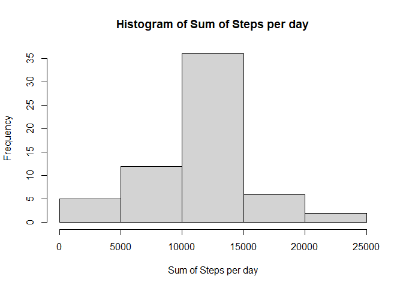

## Load libraries  

```r
library(dplyr)
library(imputeTS)
library(kableExtra)
library(ggplot2)
```


## Loading and preprocessing the data  

```r
activity <- read.csv("activity.csv")

#I want to convert the minute into text and as HHMM
intervalCh <- as.character(activity$interval)

activity$time <-  sapply(intervalCh, function(x){
    strlength <- nchar(x)
    return(paste(paste(rep("0", 4-strlength),collapse =  ""),x, 
                     sep = ""))
    }, USE.NAMES = FALSE)

activity$date <- with(activity,
                          strptime(date,
                                   format = "%F"))
```


## What is mean total number of steps taken per day?  


```r
sumPerDay = activity %>% group_by(date) %>% 
    summarise(
        sum.steps = sum(steps, na.rm = T))
hist(sumPerDay$sum.steps,
     main = "Histogram of Sum of Steps per day",
     xlab = "Sum of Steps per day")
```

<!-- -->
  
Mean and Median of Total number of steps


```r
list(
  mean = mean(sumPerDay$sum.steps, na.rm = T),
  median = median(sumPerDay$sum.steps, na.rm = T)
)
```

```
## $mean
## [1] 9354.23
## 
## $median
## [1] 10395
```

## What is the average daily activity pattern?  

```r
averagePerInterval = activity %>% group_by(interval) %>% 
    summarise(
        mean.steps = mean(steps, na.rm = T))
```

```
## `summarise()` ungrouping output (override with `.groups` argument)
```

```r
plot(averagePerInterval$interval,
     averagePerInterval$mean.steps,  type = "l")
```

<!-- -->

### To determine which 5-minute interval, on average across all the days in the dataset, contains the maximum number of steps

```r
#To determine the maximum interval
paste("The interval with maximum number of steps is",
  averagePerInterval$interval[averagePerInterval$mean.steps 
                       == max(averagePerInterval$mean.steps)])
```

```
## [1] "The interval with maximum number of steps is 835"
```


## Imputing missing values  

```r
print(paste("The number of missing values is", 
            sum(is.na(activity$steps))))
```

```
## [1] "The number of missing values is 2304"
```

```r
dfInputMissing <- activity

#Fill missing values in original dataframe
#with mean of steps in the day

missingRows <- activity[is.na(activity$steps),]

missingInputed <- missingRows
missingInputed$steps <- averagePerInterval$mean.steps[
    match(missingInputed$interval,averagePerInterval$interval)
]
dfInputMissing[is.na(dfInputMissing$steps),] <- missingInputed
```
  
  
    
This is the Histogram of the Total Number of Steps with missing values replaced   
  
  

```r
sumPerDayNoNA = dfInputMissing %>% group_by(date) %>% 
    summarise(
        sum.steps = sum(steps, na.rm = T))
hist(sumPerDayNoNA$sum.steps,
     main = "Histogram of Sum of Steps per day",
     xlab = "Sum of Steps per day")
```

<!-- -->

  
This shows the mean and median of the data with the missing values replaced  

```r
list(
  mean = mean(sumPerDayNoNA$sum.steps, na.rm = T),
  median = median(sumPerDayNoNA$sum.steps, na.rm = T)
)
```

```
## $mean
## [1] 10766.19
## 
## $median
## [1] 10766.19
```
  
  
Imputing the missing data caused the mean and median to increase  
  
  

## Are there differences in activity patterns between weekdays and weekends?  

```r
isDateWeekend <- 
    weekdays(dfInputMissing$date) %in% c("Saturday","Sunday")
dfInputMissing$is.weekend <- 
    ifelse(isDateWeekend, "weekend","weekday")

dfInputMissing$is.weekend <- as.factor(dfInputMissing$is.weekend)

byWeekendSummary <- dfInputMissing %>%
    group_by(is.weekend, interval) %>% 
    summarise(mean.steps = mean(steps, na.rm = T),
              median.steps = median(steps, na.rm = T))
```

```
## `summarise()` regrouping output by 'is.weekend' (override with `.groups` argument)
```

```r
ggplot(data = byWeekendSummary, 
       mapping = aes(interval, mean.steps)) +
    geom_line()+
    facet_grid(is.weekend~.)
```

<!-- -->


